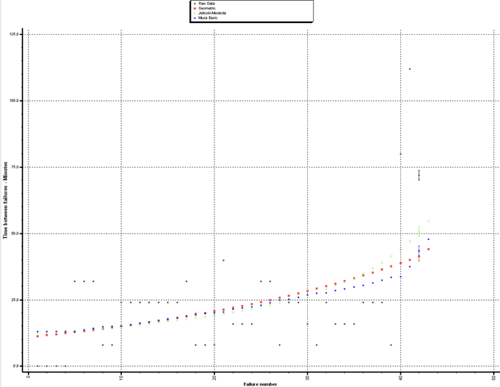
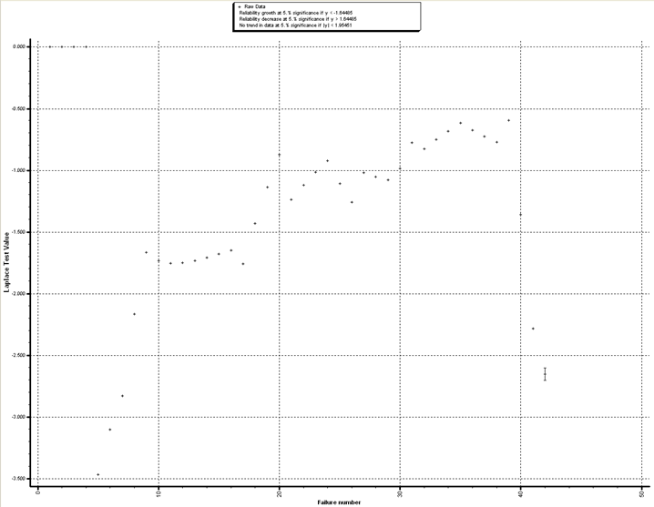
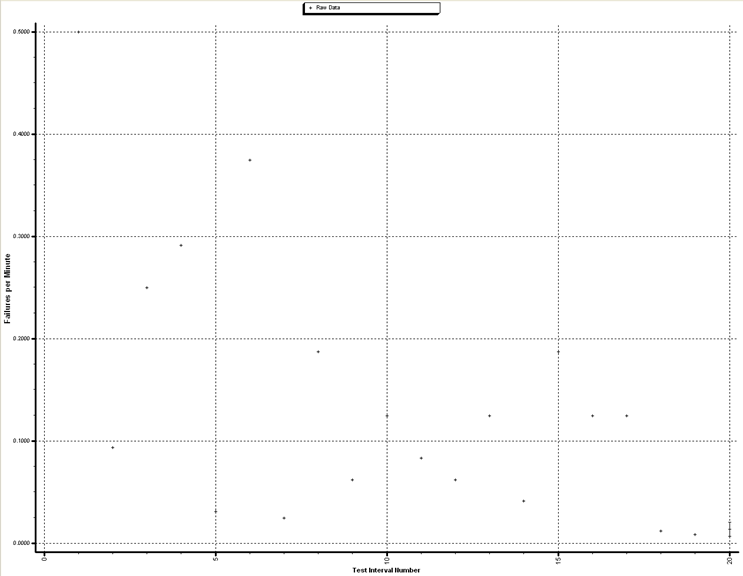
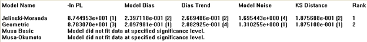
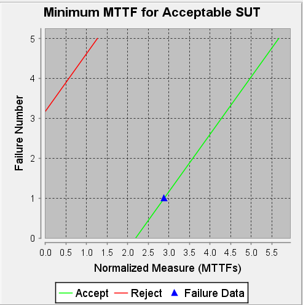
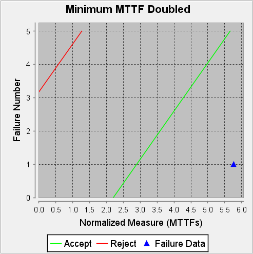
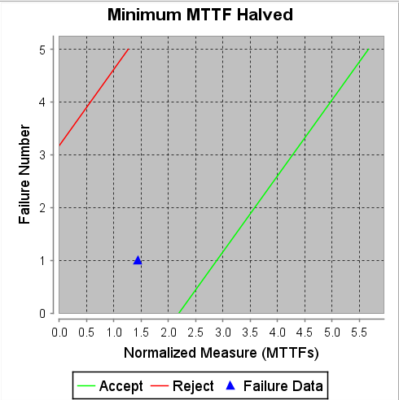

**SENG 438- Software Testing, Reliability, and Quality**

**Lab. Report #5 – Software Reliability Assessment**

<table>
  <tr>
   <td>Group 20
   </td>
   <td>
   </td>
  </tr>
  <tr>
   <td>Student Names:
   </td>
   <td>
   </td>
  </tr>
  <tr>
   <td>Rian Opperman
   </td>
   <td>30118288
   </td>
  </tr>
  <tr>
   <td>Tanish Datta
   </td>
   <td>30107335
   </td>
  </tr>
  <tr>
   <td>Arushi Gupta
   </td>
   <td>30121257
   </td>
  </tr>
  <tr>
   <td>Seniru Ruwanpura
   </td>
   <td>30122157
   </td>
  </tr>
</table>

# Introduction

The main purpose of this lab was to explore the reliability assessment using tools such as CASRE which was used in part 1 and SR-TAT for part 2. During this lab we analysed integration test data using reliability assessment tools. The two ways to assess failure data was the Reliability growth testing and Reliability assessment using Reliability Demonstration Chart (RDC). In part one we were expected to create plots of failure rate and reliability for the data set that was given to us. On the other hand, for part 2 we were expected to gain experience with the RDC tool and its usage during reliability assessment. The lab was also used for us to gain exposure to failure data as well, and touch a different angle than the rest of the labs in this course which was based on writing test cases and working with code.

**Disclaimer: **For Part 1 we used CASRE and converted the “Failure Report 1.docx” file to a .DAT so it could be used by CASRE. It is included in the Github Repo as “FE1_FC.DAT” and “FR1_FI.DAT”, which refer to the failure count and failure interval respectively. If you wish to also test this and CASRE does not run natively on your system, I would recommend using a Windows XP Virtual Machine. However, if you are running Windows 11 you will most likely need a Windows XP VM. 

# Assessment Using Reliability Growth Testing 

## Plots

Time between failures graph:

Failure report 1 Laplace Trend Test:

Failure Intensity Graph:

## Model Comparison

Model ranking results from CASRE:

From this we can see that the 2 best models to use are the Jelinski-Moranda and the Geometric model.

## Range Analysis

In regards to the range analysis, using the Laplace test above we can see that the data is quite consistent from [-0.5, -2], and as such would be a good range for testing and using further on. Any data outside of the range we can see is quite sparse and would not be good for reliability testing due to its inconsistency. This means we will only use failures 9-40 for the rest of this section. 

We can also see from the Laplace Test that as time continues the reliability of the software is decreasing, however, the slope of the graph is decreasing as time increases. This means that although the general trend of the software’s reliability is decreasing, as time continues it will eventually settle and the reliability will increase as the slope inverts itself. We can even see this evident in the last data points in the Laplace Test graph, which are much lower than the more stable 9-40 range. In fact, if the trend continues, the Laplace Test will look similar to a negative parabola.

## Discussion on Failure Rate

The current rate of failure for the system above is generally 42/712 = 0.059 failures per minute or 16.95 minutes per failure. To note, the 712 is the end time of the system and was retrieved from the failure report 1 DOCX file. However, if we use the acceptable range generated by the Laplace Test, we can see that we need to only include failures 9-40, which gives us a new failure rate of 32/528 = 0.061 failures per minute, or 16.39 minutes per failure.

In regards with the acceptability of the failure rate, we first need to understand the context of the system, as depending on if this is a critical system, frequent errors can be of great concern. For example, if we have a personnel scheduling software system with this failure rate it doesn’t pose a great threat to human lives and as such is not a critical system, so this could be an acceptable failure rate. However, if we have an elevator system with this failure rate it could be of great concern as human safety and lives are directly impacted by a failure.

## Advantages and Disadvantages

The advantages of reliability growth analysis are that we can see a trend on the reliability of the software mainly, and from that trend we can determine if the reliability of the software is increasing or decreasing. This is very useful as it determines if we need to do more testing or comb through the implementation more to fix reliability issues. Another benefit is that with growth analysis we can approximate the trend as a model, and as such can extrapolate the data to see what the reliability will be like further down the line.

A disadvantage however of reliability growth analysis is the tediousness of collecting and analyzing data and the difficulty in obtaining said data. With this method of reliability analysis we need to collect and analyze data, which obviously takes time to collect, and more time to analyze. In the fast paced, and ever evolving world of software, some can consider this process of reliability analysis as a waste of time due to the extra resources needed to collect and analyze the data, when instead more resources could be spent on testing the software, or even developing the software. Another issue is collecting only in-house reliability data can skew the results quite heavily, but using outside resources to collect the data, such as error reports for software crashes or errors, can be quite a development feat and using your customers or clients as testers generally is not a good business strategy.

# Assessment Using Reliability Demonstration Chart 

With the Reliability Demonstration Chart, as members of the group were able to get SRTAT fully working, a decision was made to use it rather than using the manual Excel sheet. This method works in both a Mac and Win64 system.

Before utilizing RDC, when trying to utilize SRTAT we were at first unable to open the Failure Reports in the included zip file which were in .docx format. To mediate this issue, we had to convert the files into a .txt format. We first worked with “Failure Report 7.txt” to test out whether our conversions were correct, resulting in a few tries until we were successful. Then similar to how we used Failure Report 1 in Part 1, we converted Failure Report 1 in a similar fashion to generate the graphs. We generated the minimum MTTFmin for when the SUT became acceptable, and calculated twice that value, and half the value for use in the report.

## 3 Plots for MTTFMin, twice and half of it for your test data.

This image shows the minimum MTTF value such that the software is accepted. We were able to generate this graph through trial and error. Based on the plotting of the minimum MTTF value, the software is accepted, as the plot is on the accept line. If a trend-line were to be drawn, based on the position of the MTTF value on the accept line and the distance between the reject line, it is highly likely that while some areas of the line would be in the continue region, the overall MTTF would mean the software was accepted. Further, SRTAT’s own analysis following the selection of the MTTF value shows an acceptance of the software. The MTTF value that was selected through trial and error was 2.78 minutes, with our FIO being 0.36 failures per minute. 

This image shows the graph for the minimum MTTF value doubled for the software being accepted. Again, this graph was generated through trial and error. Based on the plotting of the minimum MTTF value the software is accepted, as the plot goes well over the accept line, which if a trendline were to be drawn, it would be logical to extrapolate that all points would fall over the accept line. Further, the SRTAT software also stated that the software was accepted under the current scenario. As we increased the number of acceptable failures per minute by doubling it to 0.72, it makes sense that the MTTF value is now firmly in the accept region along with any other points on a line, as effectively we became more lenient for failures that occur making them more acceptable. The MTTF value is 5.56 minutes which is double of 2.78 which was the original MTTFMin value. NOTE: Please check disclaimer at end of graphs section.

This image shows the graph for the minimum MTTF value for the software being accepted being cut in half. This graph was once again generated through trial and error. Based on the plotting of the minimum MTTF value, the software testing should continue as the plot falls in between the reject and accept lines. If a trendline were to be drawn here, it would be logical to extrapolate that the trendline would all fall in between the two lines, and that points would not go beyond the reject line. Further, the SRTAT software went ahead and stated that the software was actually acceptable in the current scenario, meaning that a trendline likely goes past the accept line. The moving of the value to the left of the accept line and into the continue region makes sense as we decreased the number of acceptable failures per second to 0.18 (FIO). The MTTF Value was 1.39, which was half of the original MTTFMin Value. We made failures less acceptable overall across the software. It should be kept in mind though, that if the discrimination ratio was changed this point could have gone above the reject line and thus we would have had to reject this. This is why we should be continuing the testing rather than accepting or rejecting at its current point of time. NOTE: Please check disclaimer at end of graphs section.

**DISCLAIMER**: For the doubled and half graphs, when we increased the number of acceptable failures per second by doubling it to 0.72, that should have resulted in the half graph where the MTTFMin value was 1.39, as 1/0.72 is approximately 1.39. Furthermore, when we halved the value of acceptable failures per second to 0.18, that should have resulted in the MTTFMin value being 5.56 as that is equivalent to 1/0.18. Thus, it is likely that due to a formula issue in SRTAT, the graphs do not actually reflect the FIO value.  Doubling the FIO to 0.72 should result in the halved MTTFMin, and halving the FIO to 0.18 should result in the doubled MTTFMin, though the software makes it so that a doubled FIO causes a double MTTFMin and vice versa. A possible reason for this was that the MTTFMin can have a different formula compared to a regular MTTF based on the scenario.

## Explain your evaluation and justification of how you decide the MTTFmin

We found the MTTFmin value through trial and error every time. With SRTAT, graphs are automatically generated by inputting the test data. In Failure Report 7, there were three columns: Failure Number, Time (min), and the Severity. When this was converted to the .txt file, we were able to upload the file to SRTAT, which ignored the Severity column and inputted the Failure Number as Failure Count, and the time as Time Between Failure. This was logical as the original document file did not reflect a cumulative increase in time, rather increments in which the failure time did not go up each time. When a graph was generated, SRTAT automatically creates a graph with a Discrimination Ratio of 2, and a Customer and Developer Risk of 0.1. We kept these values the same throughout our testing, as the Discrimination Ratio should always be kept over 1 anyways. This ratio refers to the amount of error permitted in the calculation which creates the area between the accept and reject line. The Customer and Developer Risk was kept at 0.1 (which is 10 percent), as it is a generally accepted metric of either wrongly accepting the software or rejecting it when the FIO is met or not met respectively. Considering our lack of experience with SRTAT and how playing with those values during exploratory testing with the software messed up the graphs, we thought it would be highly reasonable to keep them as is and assumed that the values set as default were set like that for a reason. 

Instead, what we changed through trial and error was the failure intensity objective (FIO) which in this context were the failures per minute which was default at 1. This is also because MTTF directly correlates to the FIO measurement, as the formula for MTTF is simply 1/FIO. Something different with SRTAT which we would have needed to do in Excel was choose the number of input events to divide the failures by, but SRTAT did not give us this option, only providing a box to change up failures per minute. Thus, even though we wanted to use a whole number of events, as the units were per minute, this was not possible as increasing the default only moved the MTTFmin value further into the accept region. Therefore, we began experimenting with values that would get the MTTFMin value exactly on the accept line, as the basis of the MTTFMin is to find out the smallest time to failure possible in the system. Eventually this landed us on 0.36 failures per minute giving us an MTTFMin of 2.78 minutes, which led to the SUT being acceptable. This was then doubled and halved for the other graphs- with the exception of the formula giving us slightly mirrored results. 

It should be noted that a manual calculation for the MTTFMin would give us the reciprocal of the  FIO of 42 failures/712 events, which is around 16.95. However, as we were asked to come up with the minimum MTTFMin that would produce an acceptable result for the SUT and this particular FIO and MTTFMin only fell in the continue region, we did not use it. The value we used is what is depicted on the graph for the minimum accepted MTTFMin.

## A discussion on the advantages and disadvantages of RDC

The reliability demonstration chart method has several plus-points. Whether you used SRTAT like our group or use Excel, one of the biggest advantages is how simple it is to use in analyzing the reliability of a software under test. Compared to Part 1, Part 2 was incredibly simple to execute time-wise once we got SRTAT working as all we had to do was input the data and then let the graphs be generated. This is not a time-intensive process and is quite simple. Another benefit on this end is how you can utilize SRTAT without any formalized software tools- while we utilized SRTAT, you can use Microsoft Excel which again would only take slightly more time than using SRTAT, but is even more cost-effective. Thus in any respect, you are saving a major amount of time or resources to work with RDC. Apart from these two, other benefits include the generic ability to quantify the reliability of your SUT by examining how many failures you have in a given amount of events. All of this enables you to proactively examine the SUT for issues before a public release or some such event. By having a general trend of the failure data plotted and releasing a minimum mean time to failure value, the RDC allows us to have an expected time on average before the software fails for the first time which is valuable as a benchmark. 

On the other hand- it is only a trend. You don’t get a finite quantitative value developed for the overall reliability of the system, only getting an estimate as to how long it’ll take for a failure to occur, and in specific with MTTFMin, basing this off of the testing data. Further, something that limits how reliable the data generated through the RDC is, is the fact we had to guess and check everything. There was no definite way to immediately understand what the MTTFMin was, especially after our original calculation based on the number of failures and overall time did not reflect on the accept line of our graph. Another limitation is that based on our initial test run with RDC using Failure Report 7, we were able to garner more effective results using Failure Report 1 as there was more data to work with. Thus, overall, you need copious amounts of data to effectively use the RDC method, which means more time wasted to collect and analyze data. Finally, as the RDC is only based on data-points in a certain timeframe, this does not account for changes in reliability over a product lifetime. Thus the SUT’s actual reliability may not be properly measured and the measurement generated is likely quite arbitrary. For these reasons, the usage of the RDC on its own is discouraged and thus it should be utilized in conjunction with something like Reliability Growth Testing, which is what is being done in this lab.

# Comparison of Results

The results in Part 1 and Part 2 overall agree with each other in terms of approving and accepting the System under Test. In terms of specific differences, the values achieved in both parts were a bit different with Part 1 generating a result of 16.59 minutes per failure. If the regular formula for MTTF was used (1/FIO with the FIO being 42/712), we could have gotten 16.95, which was very close. However, as we used MTTFMin with the value being the minimum value on the accept line, we instead had our value at 2.78 minutes. Thus, even though our general results agree with each other, our specifics are a bit different. This is likely down to the difference in methodologies, and could be due to a misuse of one of the various softwares. With further instructions and clarifications on the tools, we could likely have this difference ironed out.

In terms of comparing the two techniques, reliability growth testing (RGT) should be used to analyze current reliability while the reliability demonstration chart is used at the end of the testing period to analyze if a certain failure level has been achieved. For reliability growth testing, this should be used iteratively to identify and eliminate defects and RDC simply states whether the software is reliable or not based on metrics you define such as the discrimination ratio, customer bias, and developer bias. Thus, you overall want to use the RGT to improve the reliability of the software and then use RDC to confirm that reliability has been met. Specifically for our lab, the results from Part 1 helped us look at modelling the failure data to analyze it, and then Part 2 simply helped us state whether software reliability has been met in general. Both made us realize that the SUT’s reliability was acceptable. 

# Discussion on Similarity and Differences of the Two Techniques

During this lab there were two techniques used to test reliability of software. In part 1, we used Reliability growth testing. This process involves conducting a series of tests to measure the reliability of a system or application. Throughout the process, bugs and failures are identified and eliminated so that future development of applications or systems are not hindered. This process is done earlier in development stages to predict and remove potential failure modes. 

In part 2, Reliability Demonstration Chart technique is used to graphically represent the reliability testing process. This chart mainly serves a purpose of keeping track of the development process to see where the application or system lies in terms of reliability. The Chart displays the cumulative number of units tested and the number of failures observed. This means that as more failures are recorded and plotted on the chart, the less the number of failures occur as testing continues. 

Both these techniques accomplish a similar goal, that is, increase the reliability of an application or system. Both techniques involve testing and analysis and help identify weak points in a program or system by creating statistical models. These techniques also ensure that the reliability requirements are met before deploying or launching a system, using the exact same testing data iteratively. However, the difference between the two techniques is that Reliability growth testing is a process of identifying and eliminating potential failure modes much earlier in the development phase of the project, whereas the Reliability demonstration chart is used mainly for monitoring and keeping track of the progress in a project. With statistical models, while they were both used in the different techniques, the specificity of what they are used for changes, with RGT predicting remaining defects while RDC checks the probability of whether reliability was met or not. 

Overall with RGT you are looking at a proactive ability to improve software reliability by eliminating remaining defects by modelling failure data, and RDC just assesses software reliability. 

# How the team work/effort was divided and managed

Originally the entire team was going to work on Part 1 and Part 2 together due to the differences between RGT and RDC that was mandated by the different parts. Our original plan was to just use SRTAT to achieve this. However, we quickly realized that the software just didn’t work on everyone’s computer. For example, on both Seniru and Arushi’s machines, they were not abel to get the various models to work for Part 1. SRTAT didn’t even work properly on Tanish’s machine, and it took a vast amount of time to get it to work on Part 1. Thus, the work was divided between two subteams, part 1 was given to team 1, which was composed of Tanish and Rian, and part 2 was given to team 2, which was composed of Seniru and Arushi.This team division was based on the successful division of tasks in past assignments plus the technological difficulties that were encountered. As Tanish and Rian were not even able to use C-SFRAT due to the limited functionality with respect to what was needed in the lab, they utilized CASRE instead. As Seniru and Arushi were able to get RDC working on their machines for Part 2 in SRTAT, rather than using Excel, they used SRTAT. Once the different parts were done by each team, we walked through the steps in the part assigned to that team both virtually and also in person before our demonstration. Then based on TA feedback, changes to our approach were made. 

The work was managed over our group messages where we notified one another on the progress of each part and kept up to date on the challenges and current situation of each team.

# Difficulties encountered, challenges overcome, and lessons learned

The primary difficulty encountered was getting the correct software to function to analyze the data and the fact that no one in the group could get all the software tools to work so we had to split the work accordingly. SRTAT and C-SFRAT did not manage to include all the functionality that was needed to complete each step in part 1. Primarily, we were missing the model ranking functionality and the Laplace Trend Test. For this reason we needed to switch over to CASRE, which did not work for any of our groups’ Windows machines as we were all running Windows 11; when asking other groups we found that with Windows 10 CASRE worked. For this reason we created and used a Windows XP VM to run CASRE and analyze our data.

In Part 2, we ran into a lot of different difficulties. Firstly, SRTAT’s ability to only take in .txt, .dat, and .xls files made it so that we had to take time to convert the files manually, as online file converters did not convert it properly so that SRTAT could use the file as input properly. This was incredibly challenging to us, and we had to work extensively to make sure this worked properly. Next, after we got the data to work, and had graphs generated, something that confused is why the MTTF value did not reflect the FIO calculation (effectively being mirrored where halving the FIO should have doubled the MTTF value but instead halved it as well). This was something that perplexed us for a long time, but eventually we attributed it to something that was pre-set in the software and thus would be anticipated when we made the choice to utilize MTTF as our tool for Part 2. Another difficulty was that even though our test data was in minutes, the software still put it in seconds. Thus, we wondered for a huge amount of time whether we should convert the data to seconds as well, but when we did this the graphs looked incorrect. It was only after clarification from the professor were we aware that we should have kept the data as is, and that the seconds appearing on the software instead of minutes was a GUI error.  Another overall challenge in Part 2 was simply using trial and error to find out the MTTFMin value which was a tedious process. 

The main lesson we learned from this ordeal was that there are limitations to the compatibility of new operating systems with older software and that in general most of the reliability analysis software is quite old. However, we also learnt invaluable practical experience about RDC and RGT testing and how you can use different methods to thoroughly test a given SUT. We also learnt about failure data and how we can use it to predict reliability of the software under test and prevent future failures within it. In respect to this we learned how to manually calculate the MTTF, which is a very important statistic in reliability analysis as it generally determines if your system is quite reliable or prone to faults. We also learnt about the minute differences between MTTF and MTTFMin, which could explain why our RDC graphs did not reflect manual calculations at times. Overall, we also learned how to analyze and gather reliability information from certain graphs, like the Time Between Failures graph, the Laplace Trend test and the Reliability Demonstration Chart graph.

# Comments/feedback on the lab itself

We as a team felt this lab was the worst out of all the ones we have done so far. We believe the instructions given were lackluster and throughout the whole lab we were confused as to what to do, what software to run and what data to use. Overall, we needed way more specificity in general concerning the lab. The only software we found that could do everything that was required in Part 1 was CASRE, which was a nightmare to set up, as we had to make a Windows XP Virtual Machine. In part 2, both Excel and SRTAT were not properly defined in terms of what needed to be done, and having more specific instructions similar to Lab 1 and 2 would have really helped us. Further, SRTAT didn’t even work with the given data, with no guidelines as to what the format of the data should be, having scoured every online resource available to make it work. If SRTAT was recommended to us, we feel that the data given should have been accessible on SRTAT directly rather than expecting students to convert the information ourselves. Additionally the issues regarding formula differences with the calculations and GUI errors in SRTAT confused us and made us spend more time on the lab than what should have been required. 

We also felt that the lab did not have a clear, defined purpose. We know that we are doing Reliability Testing, but what does that mean really and what is the value in doing this? With using an operating system that is around 20 years old to just get the Reliability software working, we felt as if the lab was unrealistic to current industry standards, since we could not use modern software to conduct what was required in the assignment. If this was adapted to use RGT and RDC with current standards the lessons would not only be invaluable but easily identifiable by us as well. 

In the future, if this same lab is going to be used then we would highly suggest making the instructions much more clearer and detailed, like Assignment 1’s instructions, and using a modern reliability software, like C-SFRAT, which can run on everyone’s machine. We appreciate the TA’s and Professor’s efforts to answer questions actively at points where the instructions were not descriptive- without this, the lab would likely have been almost impossible to complete. We overall want to underline that this lab is valuable- but there are many issues that have to be improved, mitigated, and solved for students to recognize its value. 
